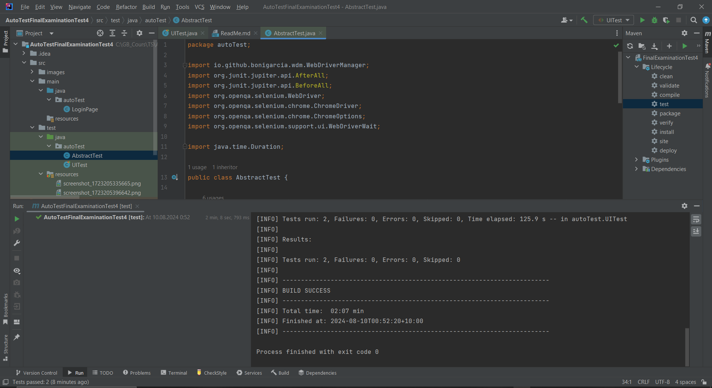
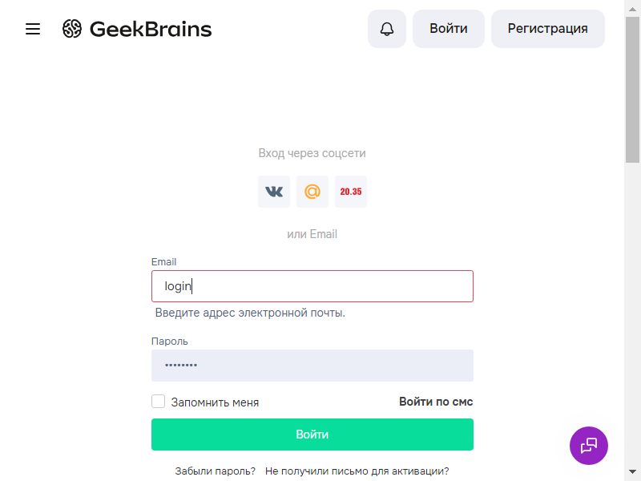
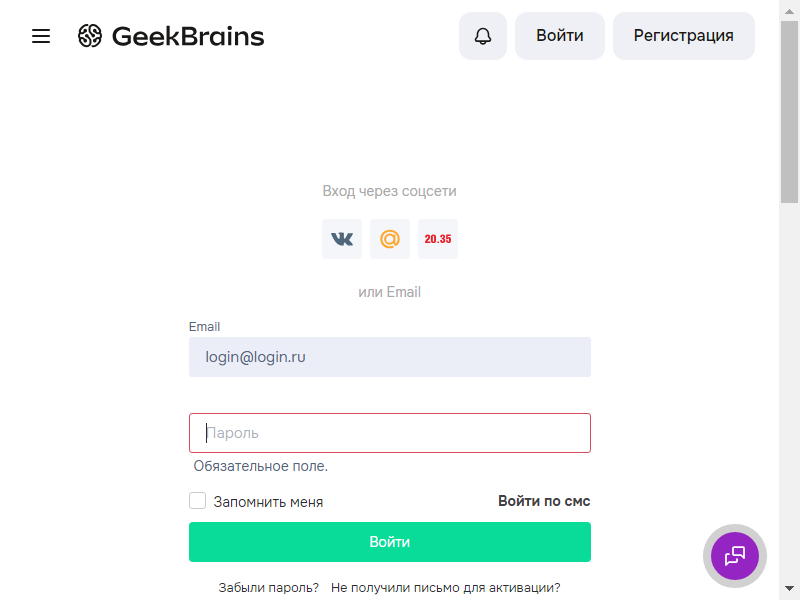

# Задание №4

Цель задания:
Проверить ваши знания в автоматизации тестирования WEB UI
Проверить ваше умение на практике использовать Selenium WebDriver
Формулировка задачи:
В блоке test реализовано несколько UI тестов. Вам необходимо сделать рефакторинг

Использовать абстрактный класс для хранения общей логики
Использовать методы before и after (JUnit 5) для вынесения повторяющихся блоков кода
Оптимизировать локаторы
Использовать паттерн PageObject
Все необходимые библиотеки уже подключены в pom.xml, webdriver устанавливается автоматически

============================================================

## Test Run:

------------------------------------------------------------

## Screenshots tests:

